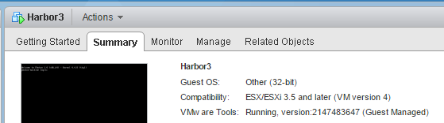
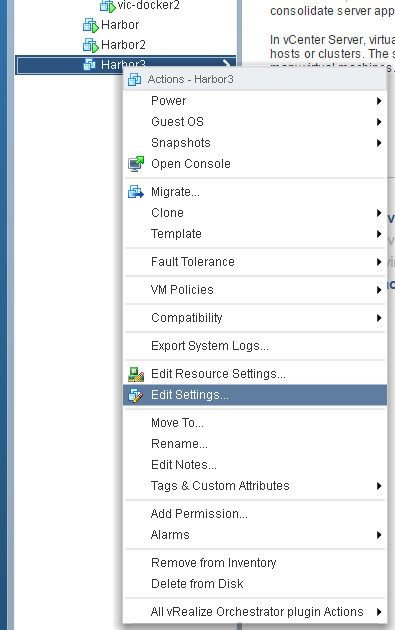
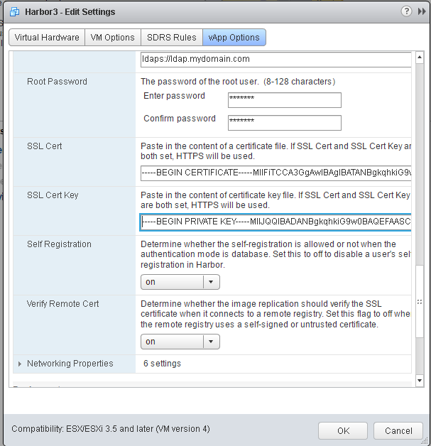

# Installing Harbor with FQDN for use with vSphere Integrated Container Engine

## Prerequisite

Harbor requires 60GB or more free space on your datastore.

## Workflow

We will use VIC Engine 0.8.0 and Harbor 0.4.5 for this example.  We will use Ubuntu as OS on our user machine.

By the end of this, we should have demonstrated,

1. Installing Habor on a vCenter installation
2. Self-generating a CA certificate, a server certificate, and a server private key
3. Updating the Harbor VM with the server certificate and private key
4. Updating a standard docker daemon with the CA certificate
5. Install a VCH with the new CA certificate
<br><br>

## Install Harbor on a vCenter installation

The first part of this install and setup can have many variations.  The important part is that we must have an FQDN for the Harbor server and we must know the assigned IP address for that server.  Future version of Harbor will not require both.  Future version will also allow the server to be installed with either FQDN or static IP, but for now, it must be installed with an FQDN.

Depending on your vCenter setup, your steps here may be different.  For our setup, we will first deploy Harbor with the OVA and fill out ONLY vApp parameters for the passwords.  Once the VM is up and running, our DNS server will assign an FQDN and IP address to the Harbor VM.  We will use the vSphere web client in this example.

Step 1: Choose Host and Cluster from the vSphere web client navigator


Step 2: Choose Deploy OVF Template


Step 3: Choose the OVA files


Step 4: Give the VM a name and choose the cluster to deploy Harbor


Step 5: Set passwords


There is no need to set anything else.  We leave the certificate and key input blank and leave the networking section to DHCP.  We go ahead and click *Finish* and then boot the VM.  In our VC installation, the VM will get an FQDN and IP on start.  Please note, the startup may take some time for the FQDN and IP to get set after the VM boots.  Below, we see the FQDN (DNS Name).  IP address is right below (not shown here).


<br><br>

## Generate a CA certificate, a server certificate, and a server private key

There are many examples and instructions on generating certificates using openssl.  Here is Harbor's docs on [setting up https](https://github.com/vmware/harbor/blob/master/docs/configure_https.md).  Hare are instructions from Docker's docs for [docker engine security](https://docs.docker.com/engine/security/https/).  Both use openssl and are similar.  We will use the one from the Harbor docs.  At the end, there will be 3 files that we will need: ca.crt, server.crt, server.key.

The steps below show a deviation from the Harbor documentation.  When generating the certificate, we generate one for a server that has an FQDN (fully qualified domain name) AND a static IP in subjectAltName.  This is a current workaround.  Harbor 0.5.0 will not need both FQDN and IP of the server.

Generate a CA certificate:  (FQDN is required. Sample data for demo purposes)

``` 
loc@Devbox:~$ mkdir mycerts
loc@Devbox:~$ cd mycerts/
loc@Devbox:~/mycerts$ openssl req -newkey rsa:4096 -nodes -sha256 -keyout ca.key -x509 -days 365 -out ca.crt
Generating a 4096 bit RSA private key
.....................................................................................................................................................++
.........................................................................++
writing new private key to 'ca.key'
-----
You are about to be asked to enter information that will be incorporated
into your certificate request.
What you are about to enter is what is called a Distinguished Name or a DN.
There are quite a few fields but you can leave some blank
For some fields there will be a default value,
If you enter '.', the field will be left blank.
-----
Country Name (2 letter code) [AU]:US
State or Province Name (full name) [Some-State]:California
Locality Name (eg, city) []:San Francisco
Organization Name (eg, company) [Internet Widgits Pty Ltd]:VMware
Organizational Unit Name (eg, section) []:vic
Common Name (e.g. server FQDN or YOUR name) []:<Habor FQDN here!>
Email Address []:
loc@Devbox:~/mycerts$ ls
ca.crt  ca.key
```

Generate a certificate signing request:  (FQDN is required. Sample data for demo purposes)

```
loc@Devbox:~/mycerts$ openssl req -newkey rsa:4096 -nodes -sha256 -keyout server.key -out server.csr
Generating a 4096 bit RSA private key
.....................................................................................................................................................................++
.....................................................................++
writing new private key to 'server.key'
-----
You are about to be asked to enter information that will be incorporated
into your certificate request.
What you are about to enter is what is called a Distinguished Name or a DN.
There are quite a few fields but you can leave some blank
For some fields there will be a default value,
If you enter '.', the field will be left blank.
-----
Country Name (2 letter code) [AU]:US
State or Province Name (full name) [Some-State]:California
Locality Name (eg, city) []:San Francisco
Organization Name (eg, company) [Internet Widgits Pty Ltd]:VMware
Organizational Unit Name (eg, section) []:vic
Common Name (e.g. server FQDN or YOUR name) []:<Habor FQDN here!>
Email Address []:

Please enter the following 'extra' attributes
to be sent with your certificate request
A challenge password []:password
An optional company name []:
loc@Devbox:~/mycerts$ ls
ca.crt  ca.key  server.csr  server.key
```
Notice above, we used the name server.key and server.csr to make it clear.  This is a deviation from the Harbor documentation.

Sign the server certificate:  (subjectAltName is required.  It is the IP from above.)

```
loc@Devbox:~/mycerts$ mkdir demoCA
loc@Devbox:~/mycerts$ cd demoCA
loc@Devbox:~/mycerts/demoCA$ touch index.txt
loc@Devbox:~/mycerts/demoCA$ echo '01' > serial
loc@Devbox:~/mycerts/demoCA$ cd ..
loc@Devbox:~/mycerts$ echo subjectAltName = IP:HarborVM_IP > extfile.cnf

loc@Devbox:~/mycerts$ openssl ca -in server.csr -out server.crt -cert ca.crt -keyfile ca.key -extfile extfile.cnf -outdir .
Using configuration from /usr/lib/ssl/openssl.cnf
Check that the request matches the signature
Signature ok
Certificate Details:
        Serial Number: 1 (0x1)
        Validity
            Not Before: Nov 11 23:53:26 2016 GMT
            Not After : Nov 11 23:53:26 2017 GMT
        Subject:
            countryName               = US
            stateOrProvinceName       = California
            organizationName          = VMware
            organizationalUnitName    = vic
            commonName                = <Habor FQDN here!>
        X509v3 extensions:
            X509v3 Subject Alternative Name: 
                IP Address:<Habor FQDN here!>
Certificate is to be certified until Nov 11 23:53:26 2017 GMT (365 days)
Sign the certificate? [y/n]:y


1 out of 1 certificate requests certified, commit? [y/n]y
Write out database with 1 new entries
Data Base Updated
loc@Devbox:~/mycerts$ ls
01.pem  ca.crt  ca.key  demoCA  extfile.cnf  server.crt  server.csr  server.key
loc@Devbox:~/mycerts$ rm server.csr

```

In the above, we only care about 3 files: ca.crt, server.crt, server.key.  We will use the server cert/key files to update the Harbor server.  We will use the ca.crt to update standard docker and our VCH. 
<br><br>

## Updating the Harbor VM with the server certificate and key

We now copy the certificate from the server.crt file.  Make sure to open file with an editor that does not modify the line ending.  Here, we use Notepad++ on Windows.  Any text editor on Linux or Mac will do.  The cert file may have a lot of information that are not necessary to us, we skip right to where we see ------BEGIN CERTIFICATE------.  We copy the entire certificate into our clipboard.


Now, we power off the Harbor VM.  Then, we edit the VM settings.



We can now goto the vApp Options and paste our server certificate into the SSL Cert input.  We then do the same for the server key by copying the text in our server.key file into the SSL Cert Key input.



Once these settings are set, we start up the VM and make sure the FQDN and IP address remain the same.
<br><br>

## Update the user working machine with the CA.crt for standard docker

We must update the standard docker on our laptop so it knows of our generated CA certificate.  Docker can look for additional CA certificates outside of the OS's CA bundle folder if we put new CA certificates in the right location, documented [here](https://docs.docker.com/engine/security/certificates/).

We create the necessary folder, copy our CA cert file there, and restart docker.  This should be all that is necessary.  We take the additional steps to verify that we can log onto our Harbor server.

```
loc@Devbox:~/mycerts$ sudo su
[sudo] password for loc: 
root@Devbox:/home/loc/mycerts# mkdir -p /etc/docker/certs.d/<Habor FQDN here!>
root@Devbox:/home/loc/mycerts# cp ca.crt /etc/docker/certs.d/<Habor FQDN here!>/
root@Devbox:/home/loc/mycerts# exit
exit
loc@Devbox:~/mycerts$ sudo systemctl daemon-reload
loc@Devbox:~/mycerts$ sudo systemctl restart docker


loc@Devbox:~$ docker logout <Habor FQDN here!>
Remove login credentials for <Habor FQDN here!>

loc@Devbox:~$ docker login <Habor FQDN here!>
Username: loc
Password: 
Login Succeeded

loc@Devbox:~$ docker logout <Habor FQDN here!>
Remove login credentials for <Habor FQDN here!>
```
<br>

## Install a VCH with the new CA certificate

In this step, we deploy a VCH and specify our CA cert via a --registry-ca parameter in vic-machine.  This parameter is a list, meaning we can easily add multiple CA certs by specifying multiple --registry-ca parameters.

For simplicity, we will install a VCH with the --no-tls flag.  This indicates we will not need TLS from a docker CLI to the VCH.  This does NOT imply that access to Harbor will be performed without TLS.

```
root@Devbox:/home/loc/go/src/github.com/vmware/vic/bin# ./vic-machine-linux create --target=<vCenter_IP> --image-store="vsanDatastore" --name=vic-docker --user=root -password=<vCenter_password> --compute-resource="/dc1/host/cluster1/Resources" --bridge-network DPortGroup --force --no-tls --registry-ca=ca.crt

WARN[2016-11-11T11:46:37-08:00] Configuring without TLS - all communications will be insecure

...

INFO[2016-11-11T11:47:57-08:00] Installer completed successfully             
```
<br>

Proceed to [Post-Install Usage](post_install_usage.md) for examples of how to use this deployed VCH with Harbor.