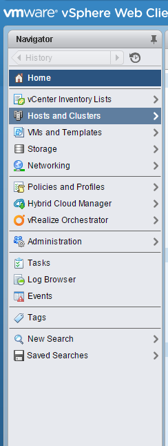
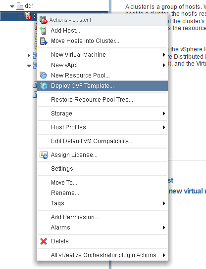
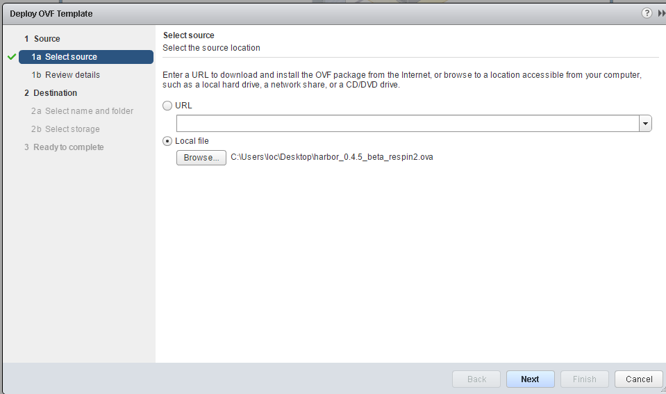
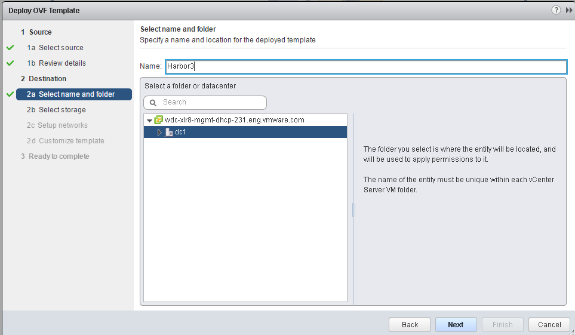
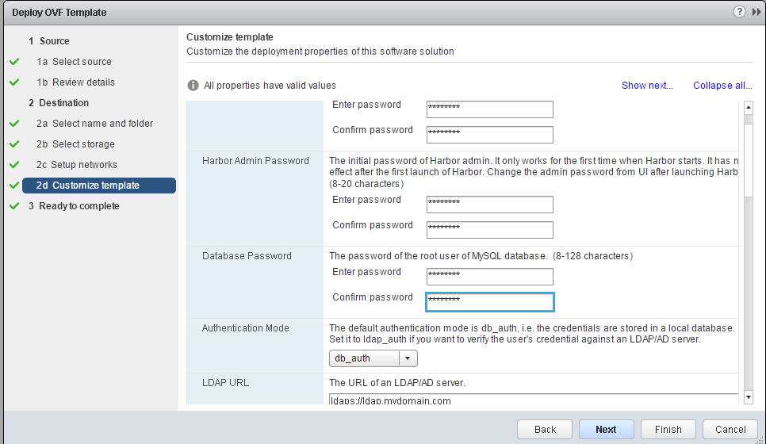
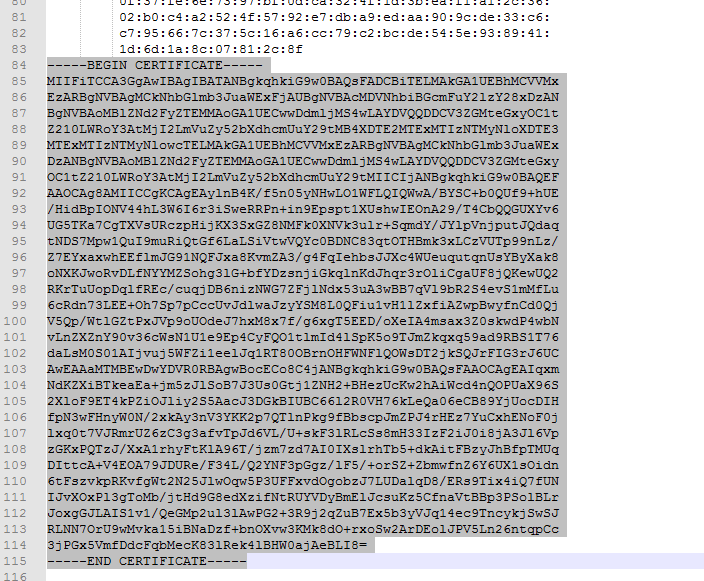
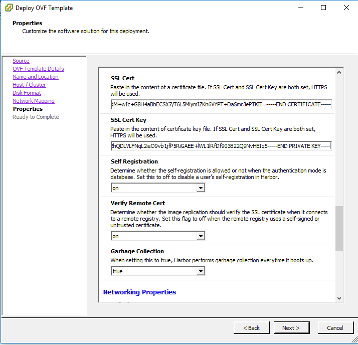

# Installing Harbor with static IP for use with vSphere Integrated Container Engine

For testing and development purposes, it is often useful to simply deploy Harbor with a static IP.  This workflow will demonstrate how to do that.  The primary difference in this workflow versus the one for FQDN will be in the vApp parameters for Harbor and the certificate generation section.  When installing Harbor with static IP, we will install Harbor with networking and the certificate in one step instead of the two steps that we listed for FQDN.  Note, our install for FQDN required two steps to accomodate our setup.  Other setups may only require 1 step.

## Prerequisite

Harbor requires 60GB or more free space on your datastore.

## Workflow

We will use VIC Engine 0.8.0 and Harbor 0.4.5 for this example.  We will also use Windows during the install of Harbor as we will use the vSphere thick client for Windows.  We will use Ubuntu as OS on our user machine for every other step.

By the end of this example, we will have demonstrated,

1. Self-generating a CA certificate, a server certificate, and a server private key for a Harbor instance with static IP
2. Installing Harbor on a vCenter installation
3. Updating a standard docker daemon with the CA certificate
4. Installing a VCH with the new CA certificate
<br><br>

## Generate a CA certificate, a server certificate, and a server private key with a static IP

There are many examples and instructions on generating certificates using openssl.  Here is Harbor's docs on [setting up https](https://github.com/vmware/harbor/blob/master/docs/configure_https.md).  Hare are instructions from Docker's docs for [docker engine security](https://docs.docker.com/engine/security/https/).  Both use openssl and are similar.  We will use the one from the Harbor docs.  At the end, there will be 3 files that we will need: ca.crt, server.crt, server.key.  We will install the server cert and key in Harbor.  We will deploy a VCH with the CA cert.

The steps below show a deviation from the Harbor documentation.  When generating the certificate, we must specify the static IP in subjectAltName AND specify the static IP in the common name when creating the server certificate and private key.  This is a current workaround.  Harbor 0.5.0 may not require the static IP in the common name.

Generate a CA certificate:
```
loc@Devbox:~/static_certs$ openssl req -newkey rsa:4096 -nodes -sha256 -keyout ca.key -x509 -days 365 -out ca.crt
Generating a 4096 bit RSA private key
........................++
..................................................................................................................................................................................................................................................++
writing new private key to 'ca.key'
-----
You are about to be asked to enter information that will be incorporated
into your certificate request.
What you are about to enter is what is called a Distinguished Name or a DN.
There are quite a few fields but you can leave some blank
For some fields there will be a default value,
If you enter '.', the field will be left blank.
-----
Country Name (2 letter code) [AU]:US
State or Province Name (full name) [Some-State]:California
Locality Name (eg, city) []:San Francisco
Organization Name (eg, company) [Internet Widgits Pty Ltd]:VMware
Organizational Unit Name (eg, section) []:vic
Common Name (e.g. server FQDN or YOUR name) []:loc
Email Address []:
loc@Devbox:~/static_certs$ ls
ca.crt  ca.key  server.csr  server.key
```

Generate a certificate signing request:  (FQDN is required. Sample data for demo purposes)

```
loc@Devbox:~/static_certs$ openssl req -newkey rsa:4096 -nodes -sha256 -keyout server.key -out server.csr
Generating a 4096 bit RSA private key
..........................................++
.......................++
writing new private key to 'server.key'
-----
You are about to be asked to enter information that will be incorporated
into your certificate request.
What you are about to enter is what is called a Distinguished Name or a DN.
There are quite a few fields but you can leave some blank
For some fields there will be a default value,
If you enter '.', the field will be left blank.
-----
Country Name (2 letter code) [AU]:US
State or Province Name (full name) [Some-State]:California
Locality Name (eg, city) []:San Francisco
Organization Name (eg, company) [Internet Widgits Pty Ltd]:VMware
Organizational Unit Name (eg, section) []:vic
Common Name (e.g. server FQDN or YOUR name) []:<Harbor static ip HERE!>
Email Address []:

Please enter the following 'extra' attributes
to be sent with your certificate request
A challenge password []:password
An optional company name []:
loc@Devbox:~/static_certs$ ls
ca.crt  ca.key  server.csr  server.key
```
**Note above, we specify the static IP that we assigned to Harbor in the common name field.**  We must do this for standard docker and VIC Engine to recognize the certificate's signing CA that we generated above.

Sign the certificate with the CA cert:

```
loc@Devbox:~/static_certs$ mkdir demoCA
loc@Devbox:~/static_certs$ cd demoCA/
loc@Devbox:~/static_certs/demoCA$ touch index.txt
loc@Devbox:~/static_certs/demoCA$ echo '01' > serial
loc@Devbox:~/static_certs/demoCA$ cd ..
loc@Devbox:~/static_certs$ ls
ca.crt  ca.key  demoCA  server.csr  server.key

loc@Devbox:~/static_certs$ echo subjectAltName = IP:<Harbor static ip HERE!> > extfile.cnf

loc@Devbox:~/static_certs$ openssl ca -in server.csr -out server.crt -cert ca.crt -keyfile ca.key -extfile extfile.cnf -outdir .
Using configuration from /usr/lib/ssl/openssl.cnf
Check that the request matches the signature
Signature ok
Certificate Details:
        Serial Number: 1 (0x1)
        Validity
            Not Before: Nov 18 00:12:14 2016 GMT
            Not After : Nov 18 00:12:14 2017 GMT
        Subject:
            countryName               = US
            stateOrProvinceName       = California
            organizationName          = VMware
            organizationalUnitName    = vic
            commonName                = <Harbor static ip HERE!>
        X509v3 extensions:
            X509v3 Subject Alternative Name: 
                IP Address:<Harbor static ip HERE!>
Certificate is to be certified until Nov 18 00:12:14 2017 GMT (365 days)
Sign the certificate? [y/n]:y


1 out of 1 certificate requests certified, commit? [y/n]y
Write out database with 1 new entries
Data Base Updated

loc@Devbox:~/static_certs$ ls
01.pem  ca.crt  ca.key  demoCA  extfile.cnf  server.crt  server.csr  server.key

loc@Devbox:~/static_certs$ rm *.csr
```
<br><br>

## Install Harbor on a vCenter installation

The first part of this install and setup can have many variations.  The important part is that we must have an FQDN for the Harbor server and we must know the assigned IP address for that server.  Future version of Harbor will not require both.  Future version will also allow the server to be installed with either FQDN or static IP, but for now, it must be installed with an FQDN.

Depending on your vCenter setup, your steps here may be different.  For our setup, we will first deploy Harbor with the OVA and fill out ONLY vApp parameters for the passwords.  Once the VM is up and running, our DNS server will assign an FQDN and IP address to the Harbor VM.  We will use the vSphere web client in this example.

Step 1: Choose Host and Cluster from the vSphere web client navigator



Step 2: Choose Deploy OVF Template



Step 3: Choose the OVA files



Step 4: Give the VM a name and choose the cluster to deploy Harbor



Step 5: Set passwords



Step 6: Copy the **server** certificate and key into the appropriate field.  Do not confuse the CA cert with server cert!  Please **note**, some editors may modify the line endings in the certificate and key.  Here, we used Notepad++ on Windows to copy the cert and key.


 
<br><br>


## Update the user working machine with the CA.crt for standard docker

We must update the standard docker on our laptop so it knows of our generated CA certificate.  Docker can look for additional CA certificates outside of the OS's CA bundle folder if we put new CA certificates in the right location, documented [here](https://docs.docker.com/engine/security/certificates/).

We create the necessary folder, copy our CA cert file there, restart docker.  This should be all that is necessary.  We take the additional steps to verify that we can log onto our Harbor server.

```
loc@Devbox:~/mycerts$ sudo su
[sudo] password for loc: 
root@Devbox:/home/loc/mycerts# mkdir -p /etc/docker/certs.d/<Habor static IP here!>
root@Devbox:/home/loc/mycerts# cp ca.crt /etc/docker/certs.d/<Habor static IP here!>/
root@Devbox:/home/loc/mycerts# exit
exit
loc@Devbox:~/mycerts$ sudo systemctl daemon-reload
loc@Devbox:~/mycerts$ sudo systemctl restart docker


loc@Devbox:~$ docker logout <Habor static IP here!>
Remove login credentials for <Habor static IP here!>

loc@Devbox:~$ docker login <Habor static IP here!>
Username: loc
Password: 
Login Succeeded

loc@Devbox:~$ docker logout <Habor static IP here!>
Remove login credentials for <Habor static IP here!>
```
<br>

## Install a VCH with the new CA certificate

In this step, we deploy a VCH and specify our CA cert via a --registry-ca parameter in vic-machine.  This parameter is a list, meaning we can easily add multiple CA certs by specifying multiple --registry-ca parameters.

For simplicity, we will install a VCH with the --no-tls flag.  This indicates we will not need TLS from a docker CLI to the VCH.  This does NOT imply that access to Harbor will be performed without TLS.

```
root@Devbox:/home/loc/go/src/github.com/vmware/vic/bin# ./vic-machine-linux create --target=<vCenter_IP> --image-store="vsanDatastore" --name=vic-docker --user=root -password=<vCenter_password> --compute-resource="/dc1/host/cluster1/Resources" --bridge-network DPortGroup --force --no-tls --registry-ca=ca.crt

WARN[2016-11-11T11:46:37-08:00] Configuring without TLS - all communications will be insecure

...

INFO[2016-11-11T11:47:57-08:00] Installer completed successfully             
```
<br>

Proceed to [Post-Install Usage](post_install_usage.md) for examples of how to use this deployed VCH with Harbor.