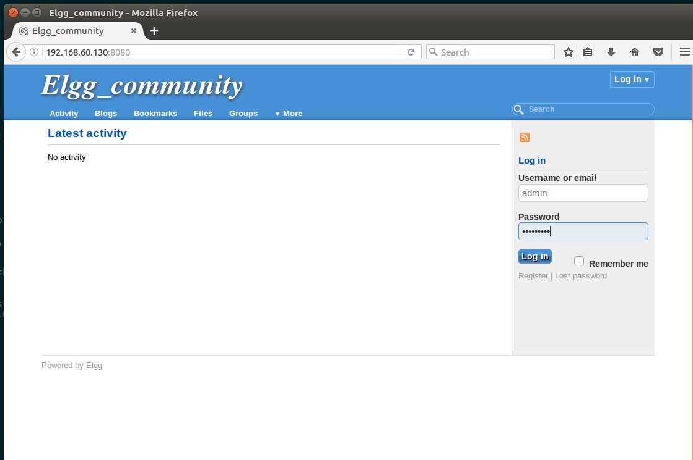

# Web-serving on vSphere Integrated Container Engine

We take the Web-serving benchmark from CloudSuite (http://cloudsuite.ch/webserving/) as an example, to demonstrate how customers who are interested in the LEMP implementation of a cloud native web-serving application could deploy it on vSphere Integrated Containers Engine 0.7.0 with Docker Compose. This demo has three tiers deployed on three containerVMs: an Nginx Web server, a Memcached server, and a MySQL database server. The Web server runs Elgg (a social networking engine) and connects the Memcached server and the database server through the network.

## Workflow

### Build docker image for the Web server (on regular docker)

In the original Web-server docker image from Cloudsuite, the functionality of “email verification for new user registration” is not enabled, which makes it less realistic and practical. Therefore, we need make some modifications and re-build the docker image for the Web server. **You can also skip this section and proceed to "[Compose File for vSphere Integrated Containers Engine](#compose-file-for-vsphere-integrated-containers-engine)" if you do not want to build your own image**.

Step I: 
Download the original installation files from https://github.com/ParsaLab/cloudsuite/tree/master/benchmarks/web-serving/web_server

Step II:
In the Dockerfile, add “Run apt-get install –y sendmail” and “EXPOSE 25”

Step III:
Replace “bootstrap.sh” with the following:

```
#!/bin/bash
hname=$(hostname)
line=$(cat /etc/hosts | grep '127.0.0.1')
line2=" web_server web_server.localdomain"
sed -i "/\b\(127.0.0.1\)\b/d" /etc/hosts
echo "$line $line2  $hname" >> /etc/hosts
cat /etc/hosts
service sendmail stop
service sendmail start
service php5-fpm restart
service nginx restart
```
Step IV: (In this example, we will deploy the image to the docker hub.)
-	Build the image: 
```
$> docker build  -t repo/directory:tag . 
```
-	Login to your registry: 
```
$> docker login (input your credentials when needed)
```
-	upload your image: 
```
$> docker push repo/directory:tag
```

### Build docker image for the MySQL server (on regular docker)

The Web server reads from the database to obtain the "site_url" to generate links for the Web pages. However, the original database image from cloudsuite (cloudsuite/web-serving:db_server) is configured with pre-defined environment variable "env web_host web_server" in the Dockerfile, which is then used to pre-dump the ELGG database with static "site_url" of "http://web_server:8080" in the image; thus the url is not accessible when deployed on the VCH. Therefore, we need to modify the database image: allow the database to be populated at the start of the containerVM using the environment variable "web_host"; then you can push the new image to your own registry. **You can also skip this section and proceed to "[Compose File for vSphere Integrated Containers Engine](#compose-file-for-vsphere-integrated-containers-engine)" if you do not want to build your own image**.

Step I: 
Download the original installation files from https://github.com/ParsaLab/cloudsuite/tree/master/benchmarks/web-serving/db_server

Step II:
In the Dockerfile, comment out the following lines:
```
ENV web_host web_server
RUN sed -i -e"s/HOST_IP/${web_host}:8080/" /elgg_db.dump
CMD bash -c "/execute.sh ${root_password}"
```

Step III:
Replace “files/execute.sh” with the following:

```
#!/bin/bash
set -x
service mysql restart
# Wait for mysql to come up
while :; do mysql -uroot -p${root_password} -e "status" && break; sleep 1; done

mysql -uroot -p$root_password -e "create database ELGG_DB;"
bash -c 'sed -i -e"s/HOST_IP/${web_host}:8080/" /elgg_db.dump'
cat /elgg_db.dump | grep 8080

# Need bash -c for redirection
bash -c "mysql -uroot -p$root_password ELGG_DB < /elgg_db.dump"

mysql -uroot -p$root_password -e "GRANT ALL PRIVILEGES ON *.* TO 'root'@'%' IDENTIFIED BY '$root_password' WITH GRANT OPTION; FLUSH PRIVILEGES;"

service mysql stop 
/usr/sbin/mysqld
```

Step IV: Same as Step IV when creating the docker image for the Web server.

### Compose File for vSphere Integrated Containers Engine
```
version: '2'

networks:
  my_net:
    driver: bridge

services:
  web_server:
    #image: your_own_web_image
    image: victest/web_elgg
    container_name: web_server
    networks:
       - my_net
    ports:
      - "8080:8080"
      - "25:25"

  mysql_server:
    #image: your_own_db_image
    image: victest/web_db
    container_name: mysql_server
    command: [bash, -c, "/execute.sh"]
    networks:
       - my_net
    environment:
       - web_host=192.168.60.130 # This is the VCH_IP
       - root_password=root  # password for the root user
       
   memcache_server:
     image: cloudsuite/web-serving:memcached_server
     container_name: memcache_server
     networks:
       - my_net    
```

### Deploy to Your VCH

Once you already have a VCH deployed by vic-machine, go to the folder where you have the above “docker-compose.yml” file and execute the following command to start the Web-serving application:
```
$> docker-compose -H VCH_IP:VCH_PORT up –d
```
Here VCH_IP and VCH_PORT can be found from the standard output when you use “vic-machine-create” to launch the VCH. Now we are ready to view the website. Open a browser and navigate to http://web_server:8080. You should be able to see the following page:


You can login in as the admin user (username: admin; password: admin1234), or register as a new user with a valid email address (Gmail does not work). You can also create your own content, invite friends, or chat with others. Enjoy! 


