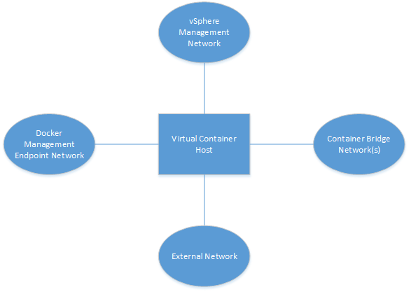

# vSphere Integrated Containers Network Overview #

vSphere Container Host connects to four network types.
 

- vSphere Management Network: to communicate with vCenter and ESXi hosts. This network also serves as a tether within the containers to communicate with the vSphere Container Host.
 
- Docker Management Endpoint Network: to connect to Docker clients and isolate the Docker endpoints from the more public external network.
 
- External Network: to connect to the internet. Containers can use this external network to publish network services. After defining the external network, you can deploy containers directly on the external interface.
 
- Container Bridge Network: to allow containers to communicate with each other.
 

## The Port Layer

You can configure networks that are tied into the vSphere infrastructure. Pre-configured networks available to a vSphere Container Host are determined by the networks that are part of the provisioning or added when you reconfigure the vSphere Container Host.

The port layer augments vSphere API with low level, platform-specific primitives to allow you to implement a simple container engine:

- Port Layer Execution: Handles container management, such as create, start, and stop. 
- Port Layer Interaction: Handles interaction with a running container. 
- Port Layer Networking: Handles specific vSphere NSX network mappings into the Docker network namespace as well as mapping existing network entities such as database servers into the Docker container namespace with defined aliases.
- Port Layer Storage: Provides storage manipulation, including container image storage, layering with volume creation and manipulation. imagec, the docker registry client library, uses this component to translate registry images into a layered format that VMDK disk chains can use directly.

## Tether Process ##

The tether process is a minimal agent in the container VM that starts and stops processes and provides monitoring statistics. 