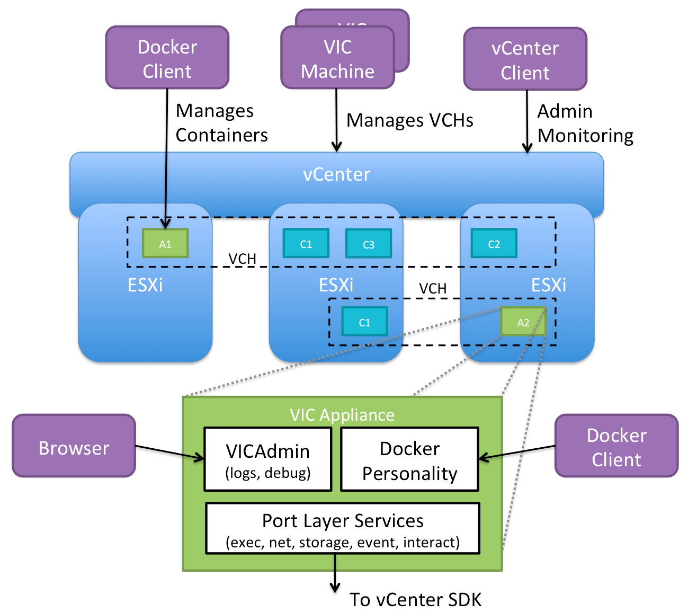

# Overview of vSphere Integrated Containers for vSphere Administrators # 

vSphere Integrated Containers enables IT teams to run traditional and container workloads side-by-side on existing infrastructure seamlessly. With vSphere Integrated Containers Engine, containers are provisioned as virtual machines, offering the same security and functionality of virtual machines in VMware ESXi&trade; hosts or vCenter Server&reg; instances.

This overview is intended for vSphere Administrators who must use vSphere Integrated Containers to manage container workloads in their vSphere environment. 

- [Introduction to Containers, Images and Volumes](#containers)
  - [Runtime](#runtime)
  - [Packaging](#packaging) 
- [What is vSphere Integrated Containers?](#whatis_vic)
- [What Does vSphere Integrated Containers Engine Do?](#what_vic_does)
- [What Is vSphere Integrated Containers Engine For?](#whats_vic_for)
- [vSphere Integrated Containers Engine Concepts](#concepts)
  - [Container VMs](#containervm) 
  - [Virtual Container Hosts](#vch) 
  - [The vSphere Integrated Containers Engine Appliance](#appliance) 
  - [The vic-machine Utility](#vic-machine) 

## Introduction to Containers, Images and Volumes ##

The word "container" is an overloaded one these days. When understanding containers and how they relate to vSphere Integrated Containers, it is helpful to distinguish the *runtime* aspect from the *packaging* aspect.

### Runtime ###

At its most basic, a container is simply a sandbox in which a process can run. The sandbox isolates the process from other processes that are running on the same system. A container has a lifecycle which is typically tied to the lifecycle of the process that it is designed to run. If you start a container, it starts its main process and when that process ends, the container stops. The container might have access to some storage. It typically has an identity on a network.

Conceptually, a container represents many of the same capabilities as a VM. The main difference between the two is the abstraction layer:

* A software container is a sandbox within a guest OS and it is up to the guest to provide the container with its dependencies and to enforce isolation. Multiple containers share the guest kernel, networking, and storage. A container does not boot. It is simply a slice of an already-running OS. The OS running the container is called its *host*.

* In contrast, a VM is a sandbox within a hypervisor. It is the hypervisor that provides a VM with its dependencies, such as virtual disks and NICs. A VM has to boot an OS and its lifecycle is typically tied to that of the OS rather than to that of any one process. By design, a VM is strongly isolated from other VMs and its host.

One of the most interesting facets of containers is how they deal with state. Any that a container writes is non-persistent by default and is lost when that container is deleted. State, however, can persist beyond the lifespan of a container by attaching a *volume* to it or by sending it over a network. Binary dependencies that the container needs, such as OS libraries or application binaries, are encapsulated in *images* . Images are immutable.

### Packaging ###

One of the most significant benefits of containers is that they allow you to package up the entire environment that an application needs and run it anywhere. You can go to Docker Hub, select from hundreds of thousands of applications and run that application anywhere that you have installed Docker on a compatible OS. The packaging encapsulates the binary dependencies, environment variables, volumes, and even the network configuration. 

The format of this packaging is called an *image*. An image is a template from which many containers can instantiate. The Docker image format allows for images to be composed in a parent-child relationship, just like a disk snapshot. This image hierarchy allows containers to share common dependencies. For example, you might have a Debian 8 image that has a child image with Java installed. That Java image might have a child with Tomcat installed. The Debian 8 image might have other children, such as PHP, Python, and so on. 

The immutability of the image format means that you never modify an image, you always create a new one. The layered nature of the image format means that you can cache commonly-used layers so that you only need to download or upload the layers that you do not already have. It also means that if you want to patch a particular image, you create a new image and then rebuild all of its children. 

The main advantage of the image format is its portability. As long as you have a destination that is running a container engine, for example Docker, and a compatible kernel ABI, you can download and run an image on it. This portability is facilitated by a *registry*. A registry is a service that indexes and stores images. You can run your own private image registry that forms part of a development pipeline. You can *push* images to the registry from development, *pull* them into a test environment for verification, and then *pull* them into a production environment.

## What is vSphere Integrated Containers? ##

vSphere Integrated Containers comprises the following major components:

- **vSphere Integrated Containers Engine**: A container engine that is designed to integrate of all the packaging and runtime benefits of containers with the enterprise capabilities of your vSphere environment. 
- **vSphere Integrated Containers Registry**: A Docker image registry with additional capabilities such as role-based access control (RBAC), replication, and so on.

Both components currently support the Docker image format. vSphere Integrated Containers is entirely Open Source and free to use. Support for vSphere Integrated Containers is included in the vSphere Enterprise Plus license.

vSphere Integrated Containers is designed to solve many of the challenges associated with putting containerized applications into production. It directly uses the clustering, dynamic scheduling, and virtualized infrastructure in vSphere and bypasses the need to maintain discrete Linux VMs as container hosts.

vSphere Integrated Containers Engine allows you, the vSphere administrator, to provide a container management endpoint to a user as a service. At the same time, you remain in complete control over the infrastructure that the container management endpoint service depends on. The main differences between vSphere Integrated Containers Engine and a classic container environment are the following:

- vSphere, not Linux, is the container host:
  - Containers are spun up *as* VMs, not *in* VMs.
  - Every container is fully isolated from the host and from the other containers.
  - vSphere provides per-tenant dynamic resource limits within a vCenter Server cluster
- vSphere, not Linux, is the infrastructure:
  - You can select vSphere networks that appear in the Docker client as container networks.
  - Images, volumes, and container state are provisioned directly to VMFS.
- vSphere is the control plane:
  - Use the Docker client to directly control selected elements of vSphere infrastructure.
  - A container endpoint Service-as-a-Service presents as a service abstraction, not as IaaS.

vSphere Integrated Containers Engine is designed to be the fastest and easiest way to provision any Linux-based workload to vSphere, if that workload can be serialized as a Docker image.

## What Does vSphere Integrated Containers Engine Do? ##

vSphere Integrated Containers Engine gives you, the vSphere administrator, the tools to easily make your vSphere infrastructure accessible to users so that they can provision container workloads into production.

**Scenario 1: A Classic Container Environment**

In a classic container environment: 

- A user raises a ticket and says, "I need Docker". 
- You provision a large Linux VM and send them the IP address.
- The user installs Docker, patches the OS, configures in-guest network and storage virtualization, secures the guest, isolates the containers, packages the containers efficiently, and manages upgrades and downtime. 
 
In this scenario, what you have given to the is user something like a nested hypervisor that they have to manage and which is opaque to you. If you scale that up to one large Linux VM per tenant, you end up creating a large distributed silo for containers.

**Scenario 2: vSphere Integrated Containers Engine**

With vSphere Integrated Containers Engine: 

- A user raises a ticket and says, "I need Docker". 
- You set aside a certain amount of storage, networking, and compute on your cluster by using a tool called `vic-machine`. 
- The `vic-machine` utility installs a small appliance. The appliance represents an authorization to use the infrastructure that you have assigned, into which the user can self-provision container workloads.
- The appliance runs a secure remote Docker API, that is the only access that the user has to the vSphere infrastructure.
- Instead of sending your user a Linux VM, you send them the IP address of the appliance, the port of the remote Docker API, and a certificate for secure access.

In this scenario, you have provide the user with a service portal. This is better for the user because they do not have to worry about isolation, patching, security, backup, and so on. It is better for you because every container that the user spins up is a VM known as a container VM. You can perform vMotion and monitor container VMs just like all of your other VMs.

If the user needs more compute capacity, in Scenario 1, the pragmatic choice is to power down the VM and reconfigure it, or give the user a new VM and let them deal with the clustering implications. Both of these solutions are disruptive to the user. With vSphere Integrated Containers Engine in Scenario 2, you can perform a simple reconfiguration that is completely transparent to the user.

vSphere Integrated Containers Engine allows you to select and dictate the appropriate infrastructure for the task in hand:

- Networking: You can select multiple port groups for different types of network traffic, ensuring that all of the containers that a user provisions get the appropriate interfaces on the right networks.
- Storage: You can select different vSphere datastores for different types of state. For example, container state is ephemeral and is unlikely to need to be backed up, but volume state almost certainly should be backed up. vSphere Integrated Containers automatically ensures that state gets written to the appropriate datastore when the user provisions a container.

To summarize, vSphere Integrated Containers Engine gives you a mechanism that allows users to self-provision VMs as containers into your virtual infrastructure.

## What Is vSphere Integrated Containers Engine For? ##

vSphere Integrated Containers Engine currently offers a subset of the Docker API. It is designed to specifically address the provisioning of containers into production, solving many of the problems highlighted in [What Does vSphere Integrated Containers Engine Do?](#what_vic_does).

vSphere Integrated Containers Engine exploits the portability of the Docker image format to present itself as an enterprise deployment target. Developers build containers on one system and push them to a registry. Containers are tested by another system and are approved for production. vSphere Integrated Containers Engine can then pull the containers out of the registry and deploy them to vSphere.

## vSphere Integrated Containers Engine Concepts ##

If you consider a Venn diagram with "What vSphere Does" in one circle and “What Docker Does” in another, the overlap is significant. The objective of vSphere Integrated Containers Engine is to take as much of vSphere as possible and layer whatever Docker capabilities are missing on top, reusing as much of Docker’s own code as possible. The  result should not sacrifice the portability of the Docker image format and should be completely transparent to a Docker client. The following sections describe key concepts and components that make this possible.

### Container VMs ###

The container VMs that vSphere Integrated Containers Engine creates have all of the characteristics of software containers:

- An ephemeral storage layer with optionally attached persistent volumes.
- A custom Linux guest OS that is designed to be "just a kernel" and that needs images to be functional.
- A mechanism for persisting and attaching read-only binary image layers.
- A PID 1 guest agent *tether* extends the control plane into the container VM.
- Various well-defined methods of configuration and state ingress and egress
- Automatically configured to various network topologies.

The provisioned container VM does not contain any OS container abstraction. 

- The container VM boots from an ISO that contains the Photon Linux kernel. Note that container VMs do not run the full Photon OS.
- The container VM is configured with a container image that is mounted as a disk. 
- Container image layers are represented as a read-only VMDK snapshot hierarchy on a vSphere datastore. At the top of this hierarchy is a read-write snapshot that stores ephemeral state. 
- Container volumes are formatted VMDKs that are attached as disks and indexed on a datastore. 
- Networks are distributed port groups that are attached as vNICs.

### Virtual Container Hosts ###

A virtual container host (VCH) is the virtual functional equivalent of a Linux VM that runs Docker, but with some significant benefits. A VCH represents the following elements:
- A clustered pool of resource into which to provision container VMs.
- A single-tenant container namespace.
- A an isolated Docker API endpoint. 
- Authorization to use and configure pre-approved virtual infrastructure.
- A private network that containers are attached to by default.

If you deploy a VCH in a vCenter Server cluster it spans all of the hosts in the cluster, providing the same flexibility and dynamic use of host resources as is the norm.

A VCH is functionally distinct from a traditional container host in the following ways:

- It naturally encapsulates clustering and dynamic scheduling by provisioning to vSphere targets.
- The resource constraints are dynamically configurable with no impact on the containers.
- Containers do not share a kernel.
- There is no local image cache. This is kept on a datastore somewhere in the cluster.
- There is no read-write shared storage

A VCH is a multi-functional appliance that you deploy as a vApp in a vCenter Server cluster or as a resource pool on an ESXi host. The vApp or resource pool provides a useful visual parent-child relationship in the vSphere Web Client so that you can easily identify the container VMs that are provisioned into a VCH. You can also specify resource limits on the vApp. You can provision multiple VCHs onto a single ESXi host, into a vSphere resource pool, or into a vCenter Server cluster.

### The vSphere Integrated Containers Engine Appliance ###

There is a 1:1 relationship between a VCH and a vSphere Integrated Containers Engine appliance. The appliance provides the following functions:

- Runs the services that a VCH requires.
- Provides a secure remote API to a client.
- Provides network forwarding so that ports to containers can be opened on the appliance and the containers can access a public network
- Manages the lifecycle of the containers, the image store, the volume store, and the container state
- Provides logging and monitoring of its own services and of its containers.

The lifecycle of the vSphere Integrated Containers Engine appliance is managed by a utility called `vic-machine`. 

### The `vic-machine` Utility ###

The `vic-machine` utility is a binary for Windows, Linux, and OSX that manages the lifecycle of VCHs. `vic-machine` has been designed for use by vSphere administrators. It takes pre-existing compute, network, storage and a vSphere user as input and creates a VCH as output. It has the following additional functions:

- Creates certificates for Docker client TLS authentication.
- Checks that prerequisites have been met on the cluster (firewall, licenses etc)
- Configures existing VCHs for debugging.
- Lists and deletes VCHs.

