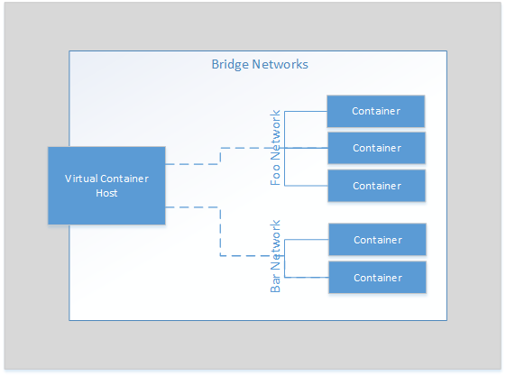
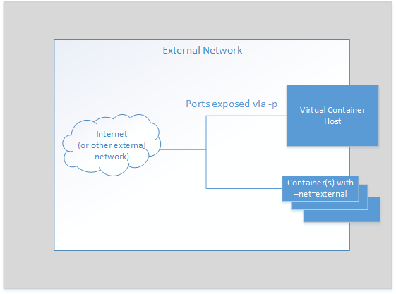
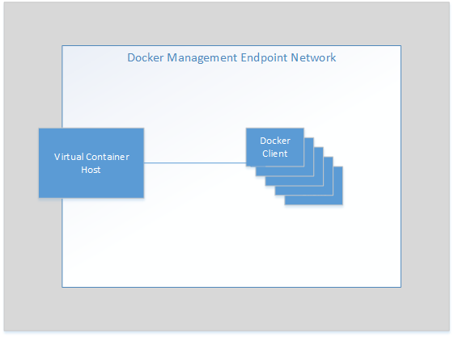

# Networks Used by vSphere Integrated Containers Engine #

You can configure networks that are tied into the vSphere infrastructure. Pre-configured networks available to a virtual container host (VCH) are determined by the networks that you define when you configure the VCH.

VCHs connect to different types of network. 

 

This topic provides an overview of the different network types. 

**IMPORTANT**: A VCH supports a maximum of 3 network port groups. Because the bridge network requires its own port group, at least two of the public, client, and management networks must share a port group. Container networks do not got through the VCH, so they are not subject to this limitation. This limitation will be removed in a future release.

## Container Bridge Networks ##
The network or networks that container VMs use to communicate with each other. Each VCH requires a unique bridge network.

You define the bridge networks by setting the `bridge-network` option when you run `vic-machine create`.  For  more detailed information about bridge networks, see the section on the `bridge-network` option in [VCH Deployment Options](vch_installer_options.md#bridge).

Container application developers can also use `docker network create` to create additional bridge networks. You can define a range of IP addresses that additional bridge networks can use by defining the `bridge-network-range` option when you run `vic-machine create`. For  more detailed information about  how to set bridge network ranges, see the section on the [`bridge-network-range` option](vch_installer_options.md#bridge-range). 

 

## Public Network  ##
The network that container VMs use to connect to the internet. Containers can use this public network to publish network services. After defining the public network, you can deploy containers directly on the public interface.

You define the public network by setting the `public-network` option when you run `vic-machine create`. For  more detailed information about management networks, see the section on the `public-network` option in [VCH Deployment Options](vch_installer_options.md#public-network).

 

## vSphere Management Network ##

The network for communication between the VCH and vCenter Server and ESXi hosts. Container VMs use this network to communicate with the VCH.

**IMPORTANT**: Because the management network provides access to your vSphere environment, and because container VMs use this network to communicate with the VCH, always use a secure network for the management network. Ideally, use separate networks for the management network and the container network.

You define the management network by setting the `management-network` option when you run `vic-machine create`. For  more detailed information about management networks, see the section on the `management-network` option in [VCH Deployment Options](vch_installer_options.md#management-network).

 

## Client Network ##

Connects the VCH endpoint VM to Docker clients and isolates the Docker endpoints from the public network.

You define the Docker management endpoint network by setting the `client-network` option when you run `vic-machine create`. For  more detailed information about Docker management endpoint networks, see the section on the `client-network` option in [VCH Deployment Options](vch_installer_options.md#client-network).

 

## Container Networks ##

Networks for container VMs to use for external communication when container developers run `docker run` or `docker create` with the `--net` option. 

You can share one network alias between multiple containers. For  more detailed information about setting up container networks, see the sections on the `container-network-xxx` options in [Virtual Container Host Deployment Options](vch_installer_options.md#container-network). 
