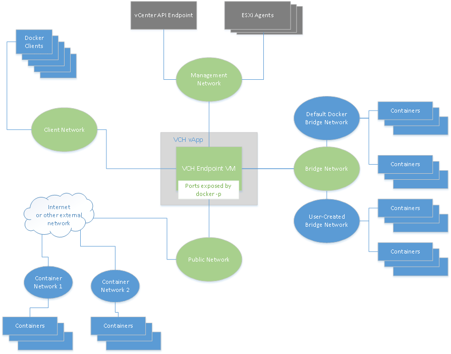

# Networks Used by vSphere Integrated Containers Engine #

You can configure networks on a virtual container host (VCH) that are tied into the vSphere infrastructure. You define which networks are available to a VCH when you deploy the VCH.

Each network that a VCH uses is a port group on either a vCenter Server instance or ESXi host.

This topic provides an overview of the different network types that virtual container hosts use.

- [High-Level View of VCH Networking](#highlevel)
- [Management Network](#management)
- [Public Network](#public)
- [Client Network](#client)
- [Bridge Network](#bridge)
- [Container Networks](#container)
- [Correspondance of Docker Networks to vSphere Integrated Containers Engine Networks](#docker_vic)

## High-Level View of VCH Networking  ##

The image below shows a high-level view of the networks that a VCH uses and how they connect to your vSphere environment and to the Docker environment that container developers use. 
 
 

The following sections describe each of the VCH network types, that are represented in the image by green elipses. The blue shapes represent   Docker objects, and the gray shapes represent vSphere. 

**IMPORTANT**: A VCH supports a maximum of 3 distinct network interfaces. The bridge network requires its own port group, at least two of the public, client, and management networks must share a network interface and therefore a port group. Container networks do not go through the VCH, so they are not subject to this limitation. This limitation will be removed in a future release.

## Management Network ##

The network for communication between the VCH and vCenter Server and ESXi hosts. The VCH uses this network to provide the `attach` function of the Docker API.

**IMPORTANT**: Because the management network provides access to your vSphere environment, and because container VMs use this network to communicate with the VCH, always use a secure network for the management network. Ideally, use separate networks for the management network and the container networks.

You define the management network by setting the `--management-network` option when you run `vic-machine create`. For more detailed information about management networks, see the section on the `--management-network` option in [VCH Deployment Options](vch_installer_options.md#management-network).

## Public Network  ##
The network that container VMs use to connect to the internet.  Ports that containers forward with 
`docker create -p` are served on the public network, so that containers can publish network services. Container developers can deploy containers directly on the public interface.

You define the public network by setting the `--public-network` option when you run `vic-machine create`. For  more detailed information about management networks, see the section on the `--public-network` option in [VCH Deployment Options](vch_installer_options.md#public-network).

## Client Network ##

The network on which the VCH endpoint VM makes the Docker API available to Docker clients. The client network isolates the Docker endpoints from the public network.

You define the Docker management endpoint network by setting the `--client-network` option when you run `vic-machine create`. For  more detailed information about Docker management endpoint networks, see the section on the `--client-network` option in [VCH Deployment Options](vch_installer_options.md#client-network).

## Bridge Network ##
The network or networks that container VMs use to communicate with each other. Each VCH requires a unique bridge network. The bridge network is a port group on a distributed virtual switch.

**IMPORTANT**: Do not use the bridge network for any other VM workloads, or as a bridge for more than one VCH.

You define the bridge networks by setting the `--bridge-network` option when you run `vic-machine create`.  For  more detailed information about bridge networks, see the section on the `--bridge-network` option in [VCH Deployment Options](vch_installer_options.md#bridge).

Container application developers can also use `docker network create` to create additional bridge networks. These networks are represented by the User-Created Bridge Network in the image above. Additional bridge networks are created by IP address segregation and are not new port groups. You can define a range of IP addresses that additional bridge networks can use by defining the `bridge-network-range` option when you run `vic-machine create`. For  more detailed information about  how to set bridge network ranges, see the section on the [`bridge-network-range` option](vch_installer_options.md#bridge-range). 

## Container Networks ##

Networks for container VMs to use for external communication when container developers run `docker run` or `docker create` with the `--net` option. Container communication on these networks does not route through the VCH, as is the case with port forwarding via the bridge network. In this way, you can remove the VCH endpoint VM as a single-point-of-failure for network traffic.

You can share one network alias between multiple containers. For  more detailed information about setting up container networks, see the sections on the `container-network-xxx` options in [Virtual Container Host Deployment Options](vch_installer_options.md#container-network). 

## Correspondance of Docker Networks to vSphere Integrated Containers Engine Networks ##

The following table matches the default Docker networks to their equivalents in vSphere Integrated Containers Engine. For information about the default Docker networks, see https://docs.docker.com/engine/userguide/networking/.

| **Docker Nomenclature** | **VIC Engine Nomenclature** |
| --- | --- |
| Default bridge network, also known as `docker0` | Bridge network |
| External networks for containers | Container networks |
| Host network | Client network |
| `none` network | No equivalent |
| User-defined bridge networks | Bridge network addresses made available by `--bridge-network-ip-range` |
| No equivalent | Management network |
| Exposed container ports | Public network |
| Overlay network | You can consider the bridge network as an overlay network as it spans all of the hosts in a cluster. |
