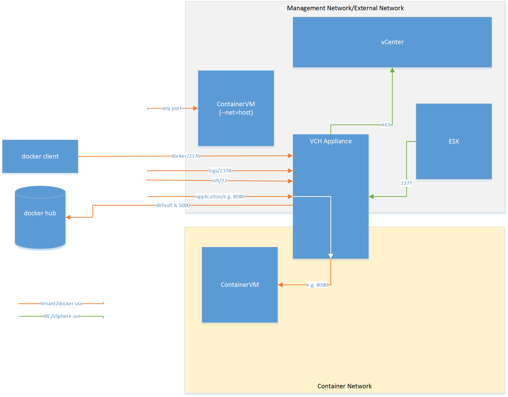

# vSphere Integrated Containers Network Overview

vSphere Container Host connects to four network types:

- vSphere Management Network: to communicate with vCenter and ESXi hosts. This network also serves as a tether within the containers to communicate with the vSphere Container Host.
- Docket Management Endpoint Network: to connect to Docker clients and isolate the Docker endpoints from the more public external network.
- External Network: to connect to the internet. Containers can use this external network to publish network services. After defining the external network, you can deploy containers directly on the external interface.
- Container Network: to allow containers to communicate with each other.

## Docker Networking and the Port Layer

You can configure networks that are tied into the vSphere infrastructure. Pre-configured networks available to a vSphere Container Host are determined by the networks that are part of the provisioning or added when you reconfigure the vSphere Container Host.

### Use Cases

These are some use cases of containers using network ports to communicate with each other.

#### Container with a Published Port

Launch a container and expose a port: `run -p`

Connect the container with the external mapped port on the external surface of the vSphere Container Host.

`$ docker run -p 8080:80 --name test1 my_container my_app`

##### Outcome

You can access Port 80 on test1 from the external network interface on the vSphere Container Host at port 8080.

#### Simple Bridge Network

Create a new non-default bridge network and set up two containers on the network. Verify that the containers can locate and communicate with each other.

    $ docker network create -d bridge my-bridge-network
    $ docker network ls
    ...
    NETWORK ID          NAME                DRIVER
    615d565d498c        my-bridge-network   bridge
    ...
    $ docker run -d --net=my-bridge-network \
                    --name=server my_server_image server_app
    $ docker run -it --name=client --net=my-bridge-network busybox
    / # ping server
    PING server (172.18.0.2): 56 data bytes
    64 bytes from 172.18.0.2: seq=0 ttl=64 time=0.073 ms
    64 bytes from 172.18.0.2: seq=1 ttl=64 time=0.092 ms
    64 bytes from 172.18.0.2: seq=2 ttl=64 time=0.088 ms

##### Outcome

Server and Client can ping each other by name.

#### Bridged Containers with Exposed Port

Connect two containers on a bridge network and set up one of the containers to publish a port via the vSphere Container Host. Assume server_app binds to port 5000.

    $ docker network create -d bridge my-bridge-network
    $ docker network ls
    ...
    NETWORK ID          NAME                DRIVER
    615d565d498c        my-bridge-network   bridge
    ...
    $ docker run -d -p 5000:5000 --net=my-bridge-network \
                    --name=server my_server_image server_app
    $ docker run -it --name=client --net=my-bridge-network busybox
    / # ping -c 3 server
    PING server (172.18.0.2): 56 data bytes
    64 bytes from 172.18.0.2: seq=0 ttl=64 time=0.073 ms
    64 bytes from 172.18.0.2: seq=1 ttl=64 time=0.092 ms
    64 bytes from 172.18.0.2: seq=2 ttl=64 time=0.088 ms
    / # telnet server 5000
    GET /

    Hello world!Connection closed by foreign host
    $ telnet vch_external_interface 5000
    Trying 192.168.218.137...
    Connected to 192.168.218.137.
    Escape character is '^]'.
    GET /

    Hello world!Connection closed by foreign host.

##### Outcome
Server and Client can ping each other by name. You can connect to the server on port 5000 from the client container and to port 5000 on the vSphere Container Host external interface.

#### Containers using External Network

Configure two external networks in vSphere:
`default-external` is `10.2.0.0/16` with gateway `10.2.0.1`  
`vic-production` is `208.91.3.0/24` with gateway `208.91.3.1`  

Associate a vSphere Container Host, then set up the vSphere Container Host to the default external network.

Attach the vSphere Container Host to the default-external network at 08.91.3.2.

`docker network ls` shows:

    $ docker network ls
    NETWORK ID          NAME                DRIVER
    e2113b821ead        none                null
    37470ed9992f        default-external    bridge
    ea96a6b919de        vic-production      bridge
    b7e91524f3e2        bridge              bridge  

You have a container providing a web service to expose outside of the vSphere Integrated Containers environment.

Output of `docker network inspect default-external`:

    [
        {
            "Name": "default-external",
            "Id": "37470ed9992f6ab922e155d8e902ca03710574d96ffbfde1b3faf541de2a701f",
            "Scope": "external",
            "Driver": "bridge",
            "IPAM": {
                "Driver": "default",
                "Options": {},
                "Config": [
                    {
                        "Subnet": "10.2.0.0/16",
                        "Gateway": "10.2.0.1"
                    }
                ]
            },
            "Containers": {},
            "Options": {}
        }
    ]

Output of `docker network inspect vic-production`:

    [
        {
            "Name": "vic-production",
            "Id": "ea96a6b919de4ca2bd627bfdf0683ca04e5a2c3360968d3c6445cb18fab6d210",
            "Scope": "external",
            "Driver": "bridge",
            "IPAM": {
                "Driver": "default",
                "Options": {},
                "Config": [
                    {
                        "Subnet": "208.91.3.0/24",
                        "Gateway": "208.91.3.1"
                    }
                ]
            },
            "Containers": {},
            "Options": {}
        }
    ]

Set up a server on the vic-production network:

    $ docker run -d --expose=80 --net=vic-production --name server my_webapp
    $ docker inspect --format='{{range .NetworkSettings.Networks}}{{.IPAddress}}{{end}}' server
    208.91.3.2
    $ telnet 208.91.3.2 80
    Trying 208.91.3.2...
    Connected to 208.91.3.2.
    Escape character is '^]'.
    GET /
    
    Hello world!Connection closed by foreign host.

**NOTE:** You can also use `-p 80` or `-p 80:80` instead of
`--expose=80`. If you try to map to different ports with `-p`, you get a configuration error.

##### Outcome

The server container port is exposed on the external network vic-production.